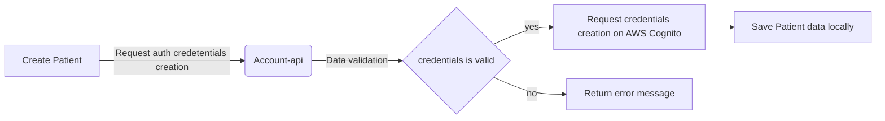
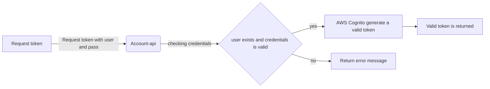

# fiap-hc-patient-api

 

API to manage patient data and create appointment requests with doctors

### Requests flow

#### 1. Create Patient

```mermaid 
      flowchart LR 
          A[Create Patient] -->|Request auth credetentials creation| B(Account-api)
          B -->|Data validation | C{credentials is valid}
          C -->|yes| D[Request credentials creation on AWS Cognito ]
          C -->|no| E[Return error message]
          F[Save Patient data locally] 
          D -->F 
```
#### 2. Request authorization token

```mermaid
     flowchart LR 
          A[Request token] -->|Request token with user and pass| B(Account-api)
          B -->|checking credentials | C{user exists and credentials is valid}
          C -->|yes| D[AWS Cognito generate a valid token]
          C -->|no| E[Return error message]
          F[Valid token is returned] 
          D -->F 
```
 
