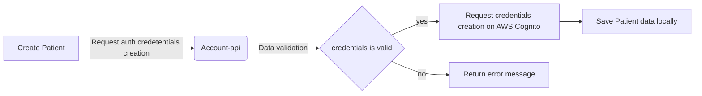
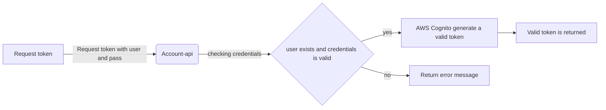
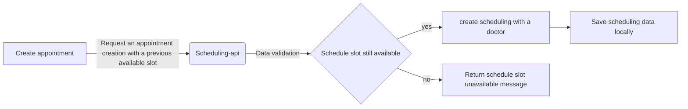

# fiap-hc-patient-api

[](https://sonarcloud.io/summary/new_code?id=tech-challenge-fiap-5soat_fiap-hc-patient-api) [](https://sonarcloud.io/summary/new_code?id=tech-challenge-fiap-5soat_fiap-hc-patient-api)
 
Fiap patient api is a system designed to manage data of patients and make available the doctors schedules. The system allows for user registration, create authorization token and create a schedule appointment on a doctors schedule.  

This service is responsible for

- Create patient
- Create patient authentication credentials
- List doctors
- Create authorization token with role patient


----
### Architecture


## Technology stack

This API was built using [Java](https://www.java.com/) and several tools:
- [Spring Boot](https://spring.io/projects/spring-boot) - Framework for creating stand-alone, production-grade Spring-based Applications
- [Maven](https://maven.apache.org/) - Dependency management and build automation tool
- [PostgreSQL](https://www.postgresql.org/) - Open-source relational database
- [Springdoc OpenAPI UI](https://springdoc.org/) - API documentation tool for Spring Boot projects
- [JUnit](https://junit.org/junit5/) - Testing framework for Java
- [Mockito](https://site.mockito.org/) - Mocking framework for unit tests
- [MapStruct](https://mapstruct.org/) - Code generator for bean mappings
- [Jackson](https://github.com/FasterXML/jackson) - JSON parser for Java
- [Amazon Cognito](https://aws.amazon.com/cognito/) - Access user management
- [Feign](https://github.com/OpenFeign/feign) - Java to HTTP client binder
- [Spring Security](https://spring.io/projects/spring-security) - Powerful and highly customizable security framework
- [Lombok](https://projectlombok.org/) - Library to reduce boilerplate code
- [Docker](https://www.docker.com/) - Platform for developing, shipping, and running applications in containers 
------

### Requests flow

#### 1. Create Patient

#### 2. Request authorization token

#### 3. Create a schedule appointment


### Development

Before run the application, you need to export the variables below:

```sh
export AWS_ACCESS_KEY_ID=test
export AWS_SECRET_ACCESS_KEY=test
```

### Testing

Locally, you can use the command below:

```sh
make test
```

This command will run all unit tests.

## Endpoints

### 1. Create Patient

**POST** /patients

```json
{
  "name": "John Doe",
  "cpf": "123.456.789-00",
  "email": "john.doe@example.com",
  "password": "password123"
}
```
**Response**: `201 Created` with the created patient object.

**Response Body**:

```json
{
  "id": 1,
  "name": "John Doe",
  "cpf": "123.456.789-00",
  "email":"john.doe@example.com"
}
```

### 2. Create patient appointment

**POST** /{doctorId}/schedules/appointment

```json
{
  "doctorId": 1,
  "patientId": 1,
  "doctorScheduleId": 1,
  "date": "2021-10-10T10:00:00"
}
```

**Response**: `200 OK` with the id of the created appointment object.

**Response Body**:

```json
{
  "id": 1
}
```

### 3. Patient login

**POST** /authorization

```json
{
  "email": "email@email.com",
  "password": "password"
}
```
**Response**: `200 OK` with the valid token of patient

**Response Body**:

```
my-valid-token
```

### 4. List all doctors

**GET** /doctors

**Response**: `200 OK` with the list of doctors.

**Response Body**:

```json
[
  {
    "id": 1,
    "name": "Doctor name",
    "cpf": "CPF",
    "crm": "CRM",
    "email": "doctor@email.com"
  }
]
```